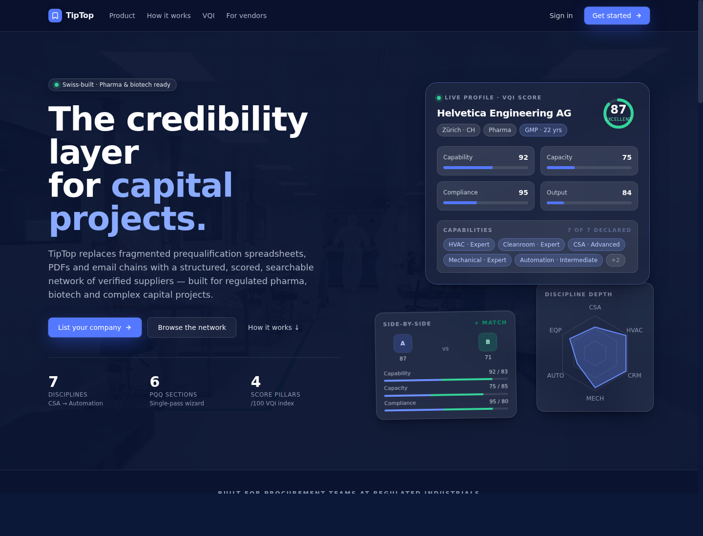
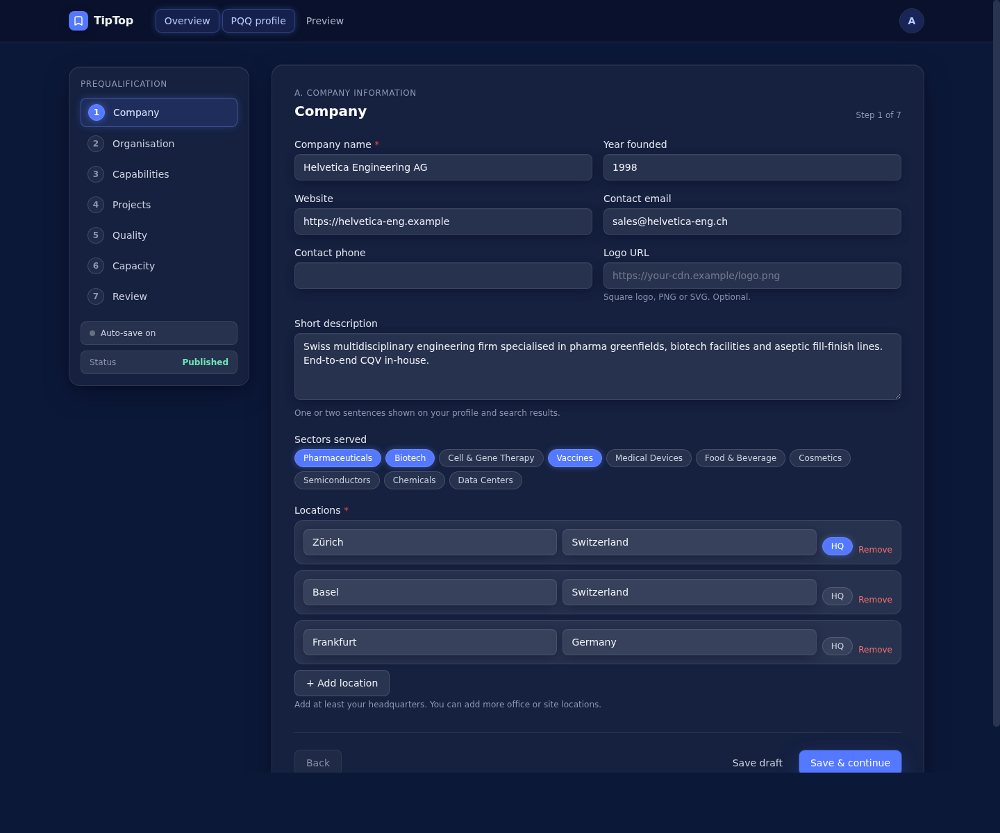
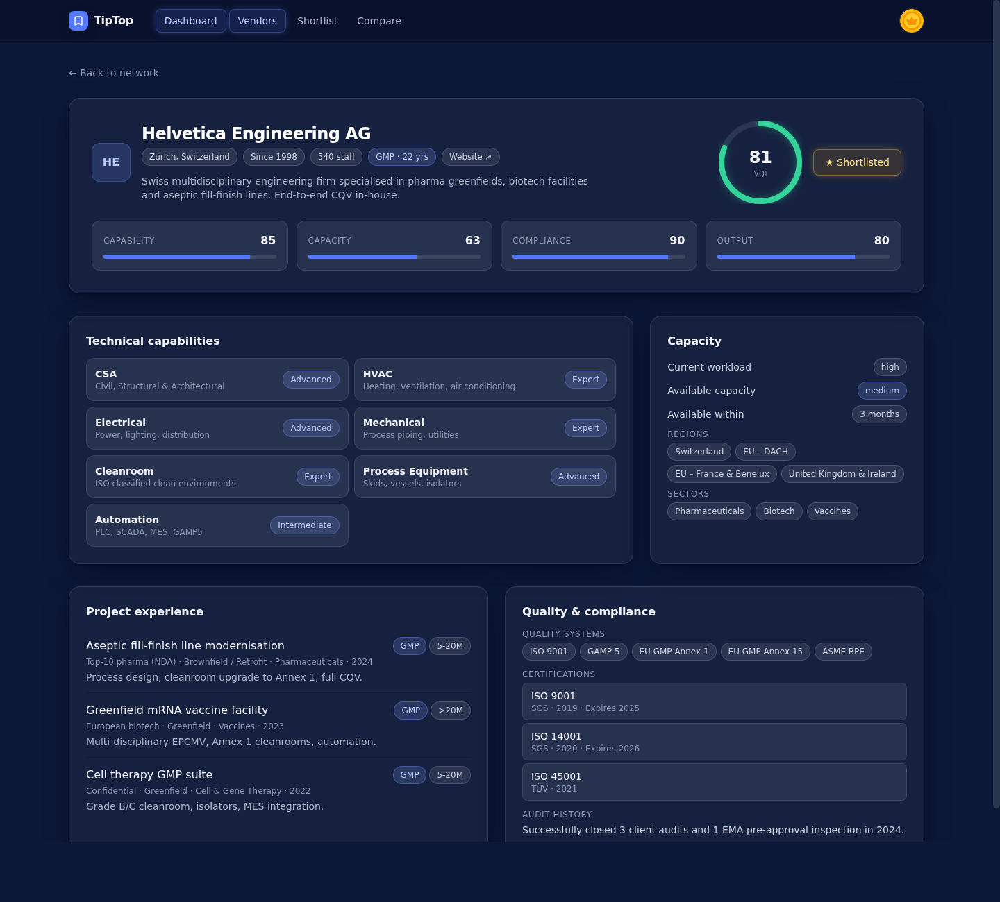
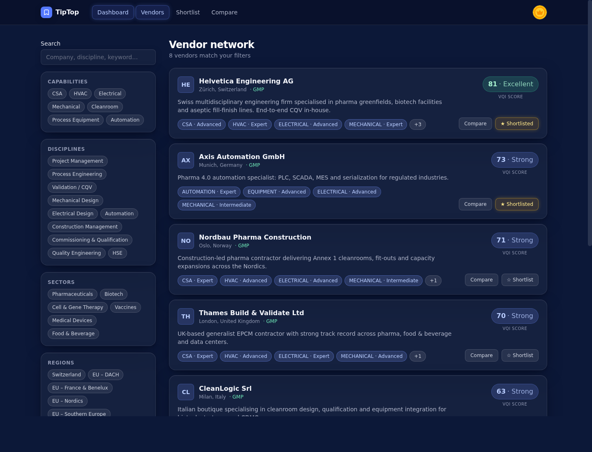
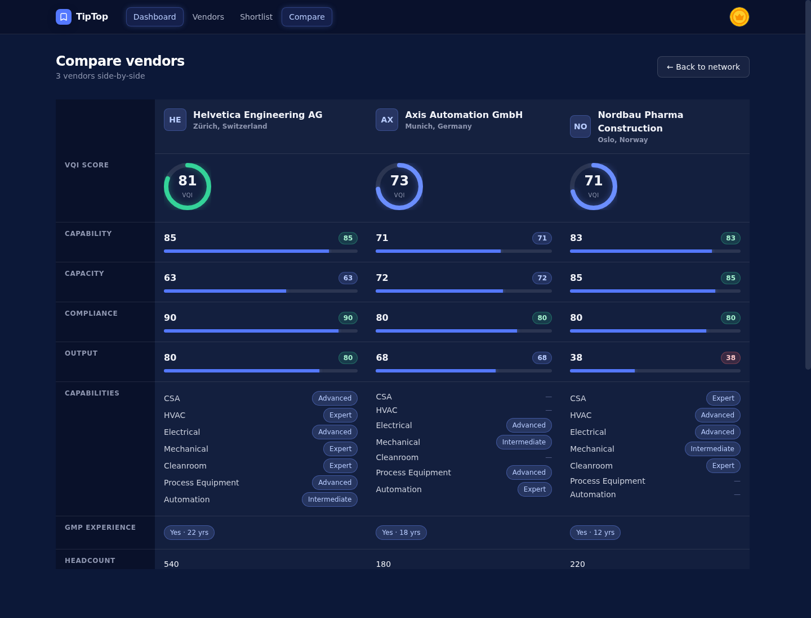
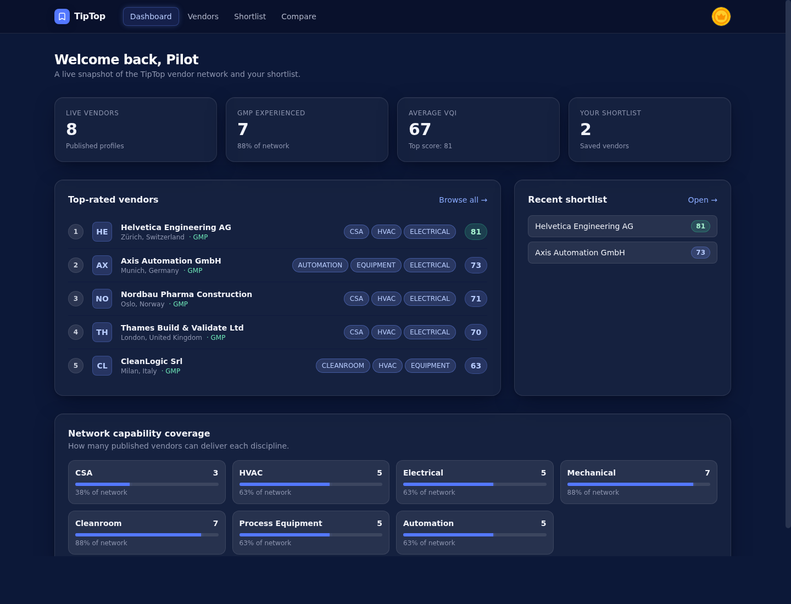
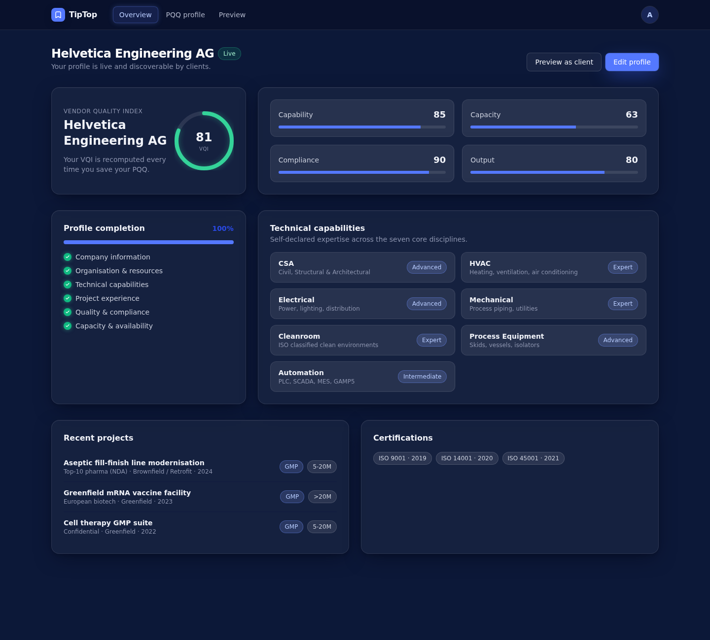
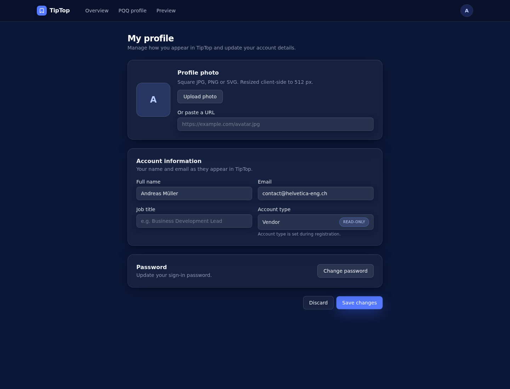

# TipTop

### The credibility layer for capital projects.

A working credibility platform for the regulated industries that still run their vendor prequalification on spreadsheets, PDFs, and email chains. Built end-to-end - design, data model, scoring engine, and product surface - for early pilot clients, vendor onboarding, and investor demos.

---

## The problem this solves

When a pharmaceutical EPCM team needs a cleanroom contractor - or a biotech CDMO needs an automation specialist - the search starts in Excel and ends in someone's inbox. Capabilities go undeclared. Certifications expire quietly. Two procurement managers shortlist the same vendor twice and neither knows it. The cost is real: missed timelines, repeated audits, projects that drift from "ready" to "rebid."

**TipTop replaces that workflow with a single structured credibility layer** - one place where vendors prequalify themselves once, a rule-based score makes them comparable, and clients can search, shortlist and side-by-side a network they actually trust.

---

## What it does

### A guided PQQ that vendors actually finish

Six prequalification sections - Company, Organisation, Capabilities, Projects, Quality and Capacity - collapse into one wizard with auto-save, per-step validation, and a *preview-as-client* mode so vendors see exactly how their profile will land before they publish.

### A score, not a guess

The Vendor Quality Index breaks credibility into four pillars - Capability, Capacity, Compliance, Output - weighted for the realities of capital-project delivery. Recomputed on every save. Transparent enough to defend in a procurement meeting.

### A network you can actually search

Filter by discipline, capability, region, GMP experience and score range. Results stream in under a quarter-second. The sidebar respects every filter the brief asked for - and remembers them.

### Three vendors, side-by-side, in one read

Pick up to three vendors and see scores, capability depth, certifications, capacity and project history laid out as a single comparable table - the difference between a 30-minute meeting and a 2-line answer.

### A dashboard built for procurement, not engineers

Live-vendor counts. Average VQI. GMP coverage. Network capability matrix. The shortlist they saved last Tuesday. All in one screen.

### Vendor-side feedback that earns the time spent

A vendor lands in their workspace and sees a live VQI, a visual completion tracker, and the next-best section to finish. The wizard is short. The reward is immediate.

### A polished sign-in experience that doesn't feel like an afterthought

A 2-thirds image / 1-third form auth split that fits in 720&nbsp;px without scrolling, switches to a clean mobile column under `md`, and still looks like it belongs to the rest of the product.

### A user profile that respects the basics

Avatars (uploaded, resized client-side, or pasted as a URL), name, email, role, and a current-password-gated password change. The dropdown shows you who you are; the page lets you change it.

---

## Built for

- Pharmaceutical, biotech and life-sciences procurement teams
- EPCM and project-management consultancies
- CDMOs and CMOs
- Cell & gene therapy build-outs and capacity expansions
- Medical-device manufacturers running an Annex 1 program
- Any regulated industrial that has ever lost a Friday to chasing a vendor's quality systems list

---

## What it's made of

`Next.js 14` · `TypeScript` · `TailwindCSS` · `Prisma` · `PostgreSQL` (Supabase) · `Zod` · `JWT auth (jose + bcrypt)`

A modern serverless-friendly stack chosen for shippable speed without giving up the structure regulated industries need: typed forms, indexable filters, a documented scoring engine, and a database schema that belongs in production - not a prototype.

---

## What "real working software" means here

This isn't a Figma board with hover states.

- Vendors can register, sign in, fill the PQQ, save drafts, publish, preview-as-client, edit and unpublish.
- Clients can register, search across the live network, filter by every dimension the brief specified, save a shortlist, compare three side-by-side, and review a full vendor profile.
- The VQI score is computed live from real inputs and stored on the row, so the search query that powers the filter slider is a single indexed `WHERE` - fast at any scale.
- The design system - dark navy base, glass surfaces, single brand accent - is consistent across the landing page, two authenticated workspaces, the auth split-screen, and the profile area.
- Every form auto-saves. Every step validates. Every error has a place to live.
- Eight realistic European pharma/biotech vendors ship with the seed so the demo is alive on first launch - not a screen full of empty states.

---

## Looking for similar work?

I build polished, production-grade web platforms for early-stage and pilot-ready B2B SaaS - typically Next.js, TypeScript, Tailwind, Prisma, Supabase, Postgres. Strong with structured-data products, scoring/ranking systems, multi-step wizards, search & filter UX, and design systems that hold together from landing page to dashboard.

If you're commissioning a vendor portal, a procurement tool, a credibility network, an internal admin, an investor-ready MVP, or a polish pass on something that's nearly there - let's talk.

**Reach me on Upwork.**
